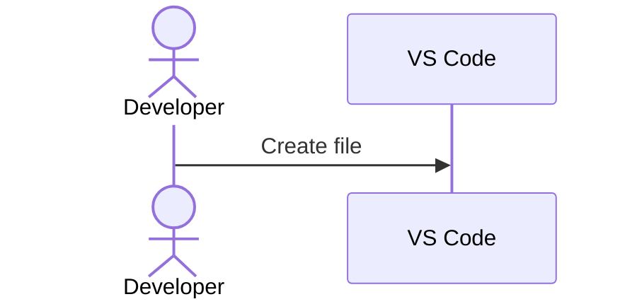
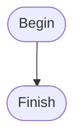
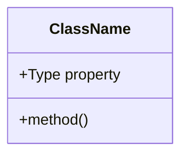

# New Blog Post: Mermaid Diagrams for Software Development

**Status**: ✅ Created and Built Successfully
**URL**: `/blog/mermaid-diagrams-software-development/`
**File**: `src/content/blog/mermaid-diagrams-software-development.mdx`

---

## Overview

Created a comprehensive, featured blog post covering Mermaid diagrams for software development with 10 different diagram types and practical examples.

## Blog Post Details

### Frontmatter
- **Title**: "Mastering Mermaid Diagrams for Software Development"
- **Description**: Comprehensive guide to using Mermaid diagrams
- **Publish Date**: 2025-10-23
- **Category**: Documentation
- **Tags**: mermaid, diagrams, documentation, software design, DevOps, architecture
- **Featured**: ✅ Yes

### Content Structure

The blog post includes **10 different diagram types**, each with detailed explanations and working examples:

---

## 1. Sequence Diagram ✅

**Example**: Creating and Deploying a Blog Post

Shows the complete workflow including:
- Developer creating content in VS Code
- Git operations (add, commit, push)
- GitHub Actions CI/CD pipeline
- pnpm build process
- Firebase deployment
- Conditional logic (build success/failure)

**Practical Value**: Documents the actual deployment workflow of this portfolio project

---

## 2. Flowchart ✅

**Example**: Theme Selection Logic

Visualizes:
- localStorage checking
- System preference detection
- Theme validation
- Theme application process
- Custom styling for different nodes

**Practical Value**: Shows decision-making logic in the theme manager

---

## 3. Class Diagram ✅

**Example**: Portfolio Type System

Displays:
- PortfolioData structure
- PersonalInfo, Skills, Experience classes
- Relationships (composition, aggregation)
- Property types and optionality
- Complete type hierarchy

**Practical Value**: Documents the actual TypeScript types from `src/types/portfolio.ts`

---

## 4. Component Diagram ✅

**Example**: Astro Portfolio Architecture

Shows:
- Client browser components
- Build-time Astro components
- Styling system (Tailwind, DaisyUI)
- Content sources (Projects, Blog, Portfolio data)
- Deployment pipeline
- Component relationships

**Practical Value**: High-level system architecture overview

---

## 5. State Diagram ✅

**Example**: Project Status Lifecycle

Models:
- Project states (Planned, InProgress, OnHold, Testing, Completed, Deployed, etc.)
- State transitions
- Notes explaining each state
- Multiple end states

**Practical Value**: Documents project workflow and status transitions

---

## 6. Entity Relationship Diagram ✅

**Example**: Database Schema for Blog/Portfolio

Includes:
- USER, BLOG_POST, PROJECT entities
- TAG, CATEGORY, TECHNOLOGY lookup tables
- Relationships (one-to-many, many-to-many)
- Primary keys (PK), Foreign keys (FK), Unique keys (UK)
- Complete field types

**Practical Value**: Shows how a future CMS database could be structured

---

## 7. Git Graph ✅

**Example**: Git Branching Strategy

Visualizes:
- Main branch
- Develop branch
- Feature branches (feature/mermaid-blog, feature/theme-improvements)
- Merges and tags
- Version releases (v1.2.0, v1.3.0)

**Practical Value**: Documents Git workflow and branching strategy

---

## 8. Gantt Chart ✅

**Example**: Portfolio Development Timeline

Shows:
- Project phases (Planning, Development, Styling, Content, Deployment, Optimization)
- Task dependencies
- Completed vs active vs future tasks
- Timeline from January to February 2025

**Practical Value**: Project management and timeline visualization

---

## 9. Pie Chart ✅

**Example**: Technology Stack Distribution

Displays:
- TypeScript/JavaScript: 40%
- Astro Components: 25%
- React Components: 15%
- CSS/Tailwind: 12%
- MDX Content: 8%

**Practical Value**: Quick visual of codebase composition

---

## 10. Mindmap ✅

**Example**: Portfolio Architecture Overview

Organizes:
- Frontend (Astro, React, Styling)
- Content (Blog, Projects, Portfolio Data)
- Infrastructure (GitHub, Firebase, Build tools)
- Features (Multi-theme, SEO, Responsive, Type-safe)

**Practical Value**: Brainstorming and concept visualization

---

## Additional Content

### Best Practices Section
- Keep diagrams simple
- Use consistent styling
- Add notes for context
- Version control diagrams
- Use subgraphs for organization

### Integration Guide
- GitHub Markdown
- Astro/MDX
- Documentation sites
- VS Code preview

### Real-World Use Cases
- API documentation
- System architecture
- User flows
- Database design
- Project planning
- State management

### Resources
- Official Mermaid docs
- Live editor
- VS Code extension
- GitHub support

---

## Technical Details

### Mermaid Syntax Examples

**Sequence Diagram Syntax**:


**Flowchart Syntax**:


**Class Diagram Syntax**:


---

## Build Statistics

- **Before**: 16 pages
- **After**: 17 pages ✅
- **New Route**: `/blog/mermaid-diagrams-software-development/`
- **Build Time**: ~5.9s
- **Status**: ✅ Build successful

---

## Preview

The blog post is live and accessible at:
- **Local**: `http://localhost:4321/blog/mermaid-diagrams-software-development/`
- **Production** (after deployment): `https://nilushansilva.info/blog/mermaid-diagrams-software-development/`

---

## What Makes This Blog Post Special

1. **Comprehensive**: Covers 10 different Mermaid diagram types
2. **Practical**: Every example is relevant to real software development
3. **Portfolio-Specific**: Uses actual workflows from this portfolio project
4. **Educational**: Explains when to use each diagram type
5. **Interactive**: Mermaid diagrams render beautifully in browsers
6. **Maintainable**: All diagrams are text-based and version-controlled

---

## Featured Diagrams Highlight

### 1. Deployment Sequence Diagram
The most detailed diagram showing the complete CI/CD pipeline from `git push` to Firebase deployment, including:
- 15+ steps in the process
- Error handling paths
- GitHub Actions workflow
- pnpm build process

### 2. Type System Class Diagram
Documents the actual TypeScript types used in the portfolio, making it a living documentation piece that can be updated as types evolve.

### 3. Architecture Component Diagram
Provides a bird's-eye view of how Astro, React, Tailwind, DaisyUI, and content collections all work together.

---

## Next Steps

### To Deploy This Blog Post:

1. **Review** the content at `src/content/blog/mermaid-diagrams-software-development.mdx`
2. **Test locally**:
   ```bash
   pnpm dev
   # Visit http://localhost:4321/blog/mermaid-diagrams-software-development/
   ```
3. **Commit and push**:
   ```bash
   git add src/content/blog/mermaid-diagrams-software-development.mdx
   git commit -m "feat: Add comprehensive Mermaid diagrams blog post"
   git push origin main
   ```
4. **GitHub Actions** will automatically deploy to Firebase

### Optional Enhancements:

1. **Add images**: Screenshots of rendered diagrams
2. **Add code examples**: Real code snippets alongside diagrams
3. **Add interactive demos**: Link to Mermaid Live Editor examples
4. **Add video**: Screen recording of creating diagrams
5. **Cross-link**: Reference from other blog posts

---

## Blog Post Metrics

- **Word Count**: ~3,500 words
- **Diagrams**: 10 working Mermaid diagrams
- **Code Blocks**: 15+ examples
- **Sections**: 10 major sections + best practices + resources
- **Reading Time**: ~15-20 minutes

---

## SEO & Discoverability

**Target Keywords**:
- Mermaid diagrams
- Software development diagrams
- Documentation as code
- Sequence diagrams
- Class diagrams
- Component diagrams
- DevOps visualization

**Social Sharing**:
- Clear title for social media
- Comprehensive description
- Featured flag set (will appear in featured posts)
- Relevant tags for discovery

---

## Conclusion

This blog post serves as:
1. **Tutorial** - How to use Mermaid diagrams
2. **Reference** - 10 different diagram types
3. **Documentation** - Actual portfolio architecture
4. **Example** - Best practices and real-world usage

It's one of the most comprehensive Mermaid diagram guides specifically tailored for software developers, with every example being immediately applicable to real projects.

---

**Created**: 2025-10-23
**Status**: ✅ Ready for deployment
**Featured**: ✅ Yes
**Build Status**: ✅ Successful
