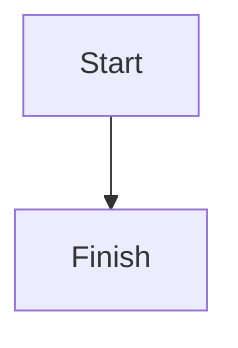

# Mermaid diagrams

Mermaid code fences in blog MDX files are prepared by the `astro-mermaid` integration and rendered in the browser by its generated client module.

## Configuration

`astro.config.mjs` registers the integration:

```js
import mermaid from 'astro-mermaid';

mermaid({
  theme: 'base',
})
```

The required packages are listed in `package.json`. The integration transforms fences to Mermaid-ready markup during content processing and injects the client module that renders SVG diagrams. There is no custom `MermaidInit` component.

## Authoring

Add a Mermaid fence to an MDX file:

````md

````

The full example article is `src/content/blog/mermaid-diagrams-software-development.mdx`. It demonstrates sequence, flowchart, class, component-style flowchart, state, entity-relationship, Git, Gantt, pie, and mind-map diagrams.

## Validation

Run:

```bash
pnpm build
```

A syntax error in a diagram should fail or warn during content processing. Preview the generated article as well, especially after changing themes or diagram CSS:

```bash
pnpm preview
```

## Performance

Diagram rendering requires Mermaid JavaScript on pages containing diagrams. The integration manages initialization, but the Mermaid bundle is substantial; avoid enabling diagrams on content that does not need them. Keep diagrams focused and split very large diagrams to maintain readable output on narrow screens.

## Troubleshooting

- Confirm the fence language is exactly `mermaid`.
- Validate syntax in the [Mermaid Live Editor](https://mermaid.live/).
- Check that `astro-mermaid` remains registered after `mdx()` in Astro integrations.
- Inspect the built article on mobile for overflow or unreadably small labels.
