Mermaid is a powerful JavaScript-based diagramming and charting tool that lets you create diagrams using text and code. It's particularly valuable for software developers because diagrams can be version-controlled, reviewed, and maintained alongside your code.

In this post, I'll explore the different types of Mermaid diagrams that are most useful for software development, with practical examples you can use immediately.

## Why Mermaid?

Before diving into the diagram types, here's why I love Mermaid:

- **Text-based**: Store diagrams in version control with your code
- **Easy to maintain**: Update diagrams by editing text, not dragging boxes
- **GitHub-native**: Renders automatically in GitHub README files and issues
- **No special tools**: Works in Markdown, documentation sites, and many IDEs
- **Consistent styling**: Automatic layout and theming

## 1. Sequence Diagrams

Sequence diagrams are perfect for visualizing interactions over time. Let's model the process of creating and deploying a blog post in this very portfolio project.

### Creating and Deploying a Blog Post

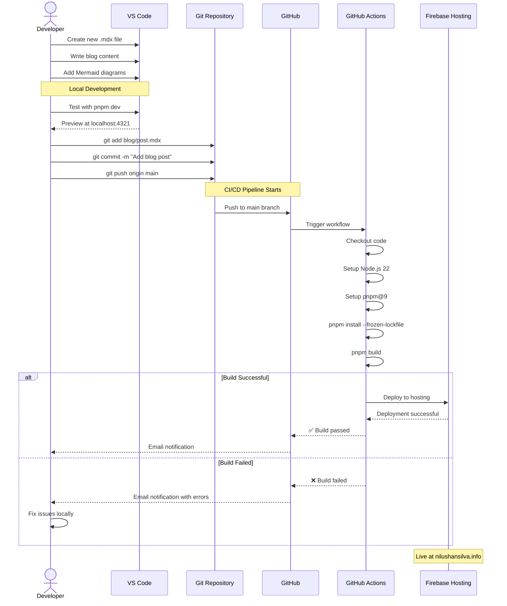

This sequence diagram shows the complete workflow from creating a blog post to deployment. Notice how it captures:
- User interactions
- System processes
- Conditional logic (build success/failure)
- Notes for context

## 2. Flowcharts

Flowcharts are ideal for showing decision trees and process flows. Here's how the portfolio site decides which theme to apply:

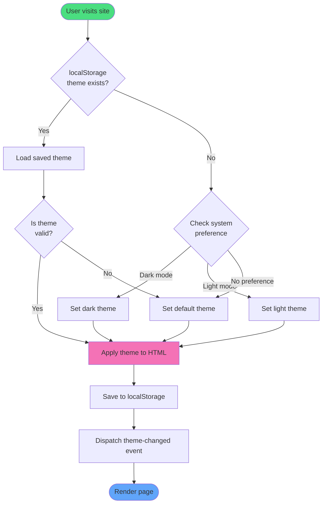

## 3. Class Diagrams

Class diagrams show object-oriented structure. Here's the type system for the portfolio data:

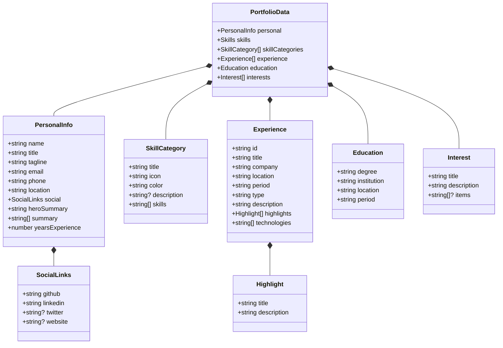

This shows the complete type hierarchy of the portfolio data structure, including:
- Composition relationships (`*--`)
- Property types (string, arrays, optional)
- Nested objects

## 4. Component Diagrams

Component diagrams visualize system architecture. Here's the Astro portfolio architecture:

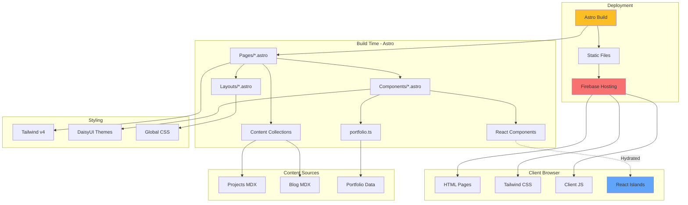

## 5. State Diagrams

State diagrams model state transitions. Here's the project status lifecycle:

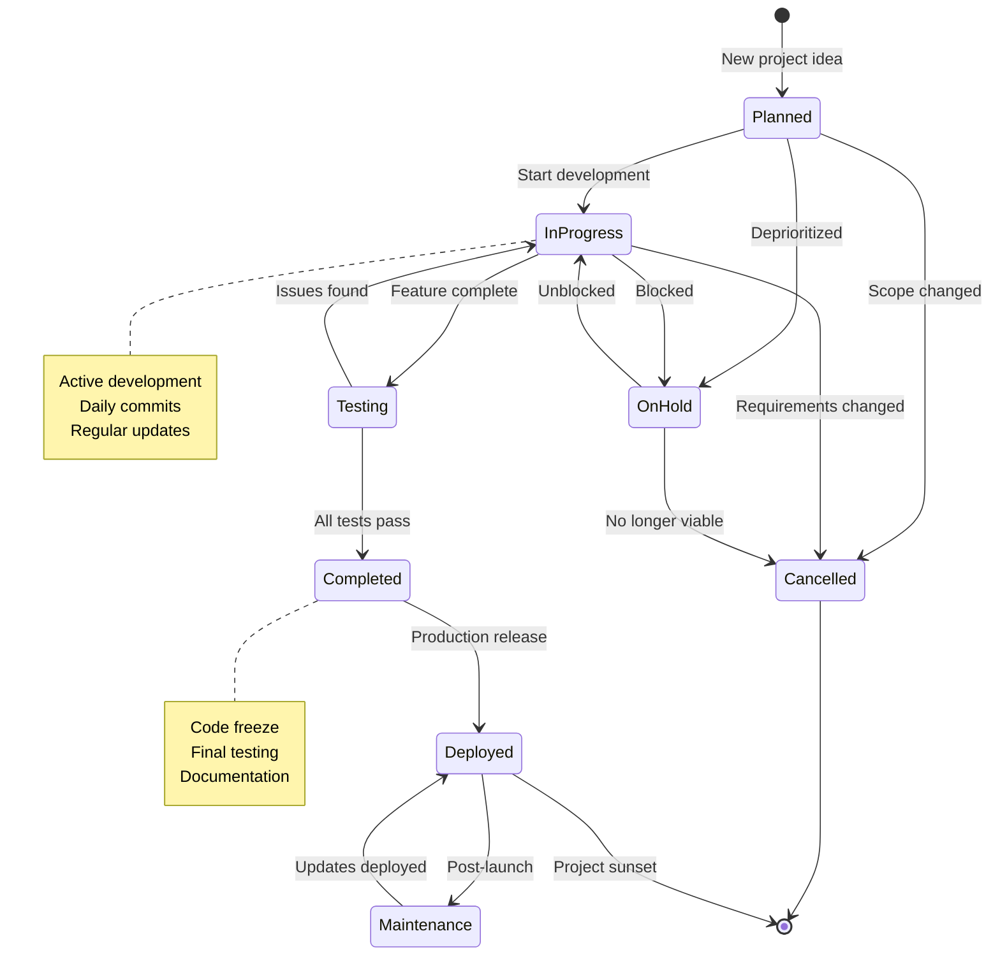

## 6. Entity Relationship Diagrams

ER diagrams are perfect for database schema visualization:

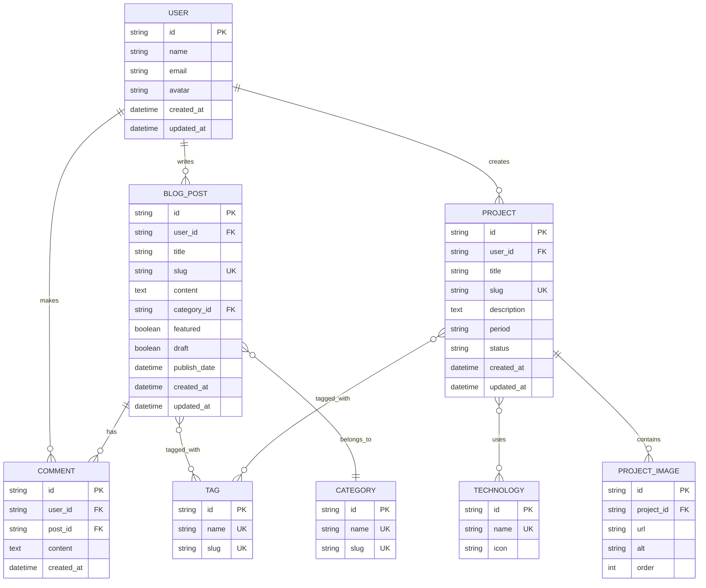

## 7. Git Graph

Visualize your Git branching strategy:

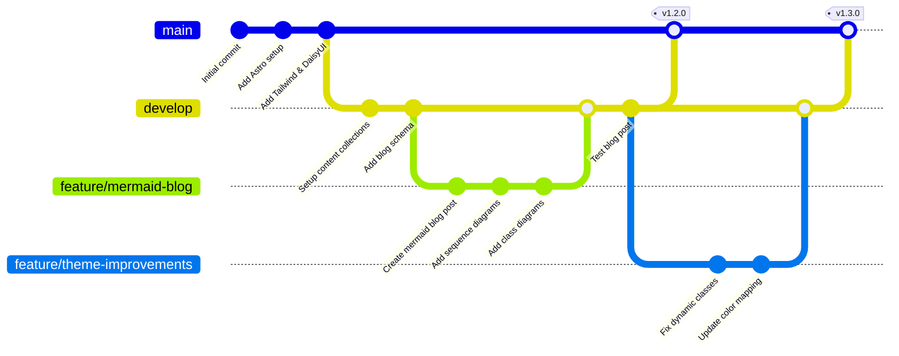

## 8. Gantt Charts

Project timeline visualization:

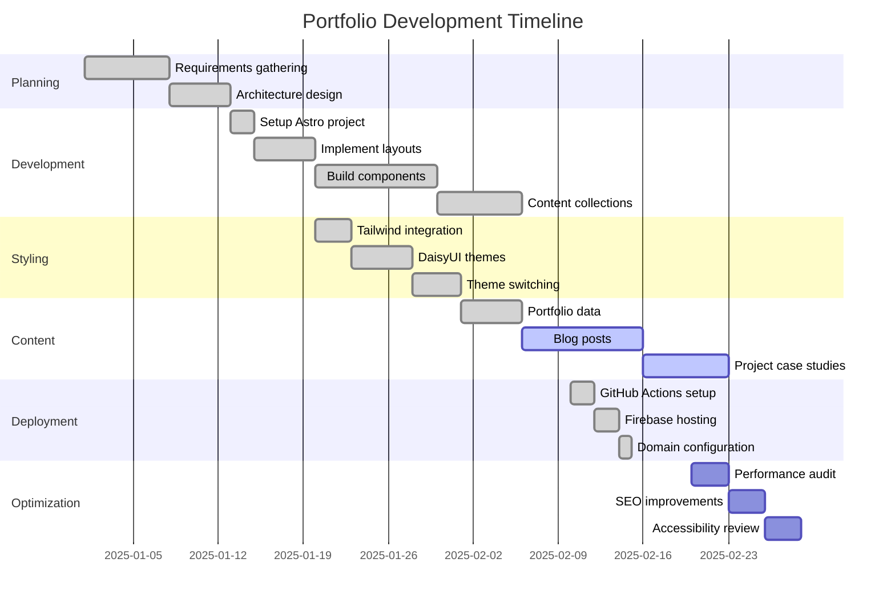

## 9. Pie Charts and Bar Charts

For data visualization:

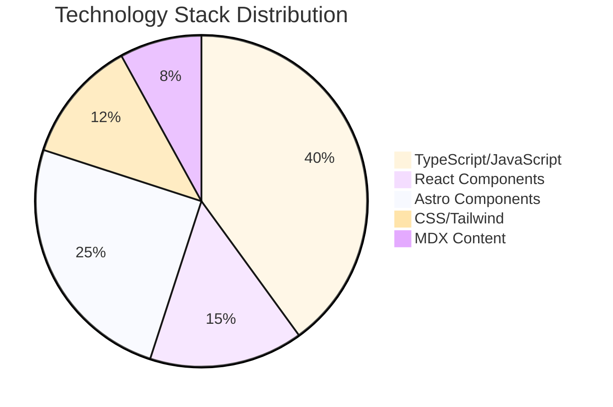

## 10. Mindmaps

For brainstorming and concept mapping:

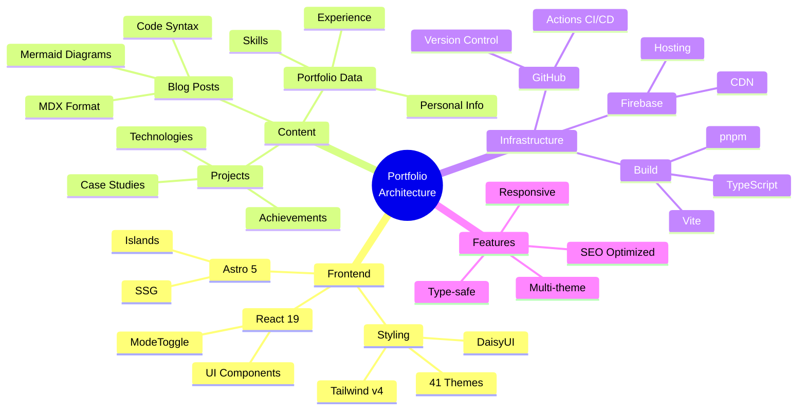

## Best Practices for Mermaid Diagrams

### 1. Keep It Simple
Don't try to show everything in one diagram. Break complex systems into multiple focused diagrams.

### 2. Use Consistent Styling
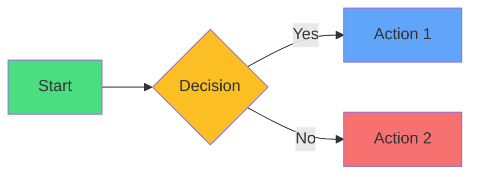

### 3. Add Notes for Context
Notes help explain non-obvious aspects of your diagrams.

### 4. Version Control Your Diagrams
Since they're text, they diff well and can be code-reviewed.

### 5. Use Subgraphs for Organization
Group related components together for clarity.

## Integrating Mermaid in Your Projects

### In Markdown (GitHub)
Just use code blocks with `mermaid` language:

~~~markdown
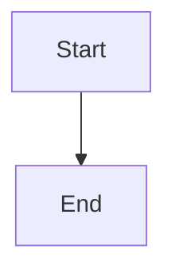
~~~

### In Astro (like this blog)
Astro automatically renders Mermaid diagrams in MDX files when you have the proper remark plugin configured.

### In Documentation Sites
Most modern documentation frameworks (Docusaurus, VuePress, Starlight) support Mermaid out of the box.

### In VS Code
Install the "Markdown Preview Mermaid Support" extension for live preview.

## Real-World Use Cases

### 1. API Documentation
Use sequence diagrams to show API request/response flows.

### 2. System Architecture
Component diagrams for microservices architecture.

### 3. User Flows
Flowcharts for UX documentation.

### 4. Database Design
ER diagrams for schema documentation.

### 5. Project Planning
Gantt charts for sprint planning.

### 6. State Management
State diagrams for Redux/Zustand flows.

## Conclusion

Mermaid diagrams are an invaluable tool for software developers. They allow you to:

- **Document as you code** - No context switching to diagramming tools
- **Review diagrams in PRs** - See exactly what changed
- **Keep docs in sync** - Update diagrams with code changes
- **Onboard faster** - Visual documentation is easier to understand
- **Communicate clearly** - A diagram is worth a thousand lines of code

The best part? You can start using Mermaid today. Just add a code block with `mermaid` syntax to your next Markdown file, and you're ready to go!

## Resources

- [Mermaid Official Documentation](https://mermaid.js.org/)
- [Mermaid Live Editor](https://mermaid.live/) - Test your diagrams online
- [VS Code Extension](https://marketplace.visualstudio.com/items?itemName=bierner.markdown-mermaid)
- [GitHub Mermaid Support](https://github.blog/2022-02-14-include-diagrams-markdown-files-mermaid/)

Happy diagramming! 📊

---

*Have you used Mermaid in your projects? What's your favorite diagram type? Let me know in the comments or reach out on [GitHub](https://github.com/nilushan)!*
