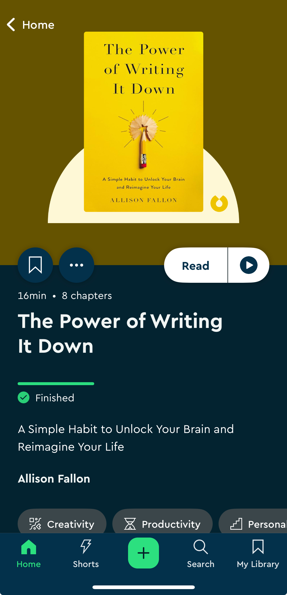

I listened to the book "The Power of Writing It Down" using Blinkist. It was a quick listen but created a desire within me to write down rough thoughts even though it might not be perfect. 

## Highlights from the book/blink
Highlighted Quotes from the blink 

### Summary 

Words have incredible power and we are all writers whether we reliaze it or not. Through expressive writing, we can unlock deeper understanding of ourselves and our experiences. Simple techniques like asking questions, explaining our personal narratives, and writing as if to someone specific can transform vague thoughts into powerful insights that help us live more authentically. 

> Simple act of putting words on paper can spark profound changes in your life.

> "You are, in fact, a writer."

> When we write down our thoughts, express ourselves in words, and articulate our deepest desires, we tap into language's transformative potential.

> "Writing it down" can help you live a more fulfilled and authentic life.

### Expressive writing
Expressive writing is writing that helps you explore your thoughts and feelings without worrying about perfect grammar or polished prose. Think of it as a conversation with yourself on paper, where you can be completely honest and unfiltered. 

Expressive writing can help clarify your desires, connect you with your subconscious, and reveal your authentic voice. Through expressive writing, you can process difficult emotions, work through challenges, set clearer goals, or even heal from past experiences. 

### How to create a sustainable expressive writing practice

- Create a physical space for writing

- Carve out time in your calendar and treat it as a non-negotiable commitment 

- Create mental space.
Sit in your writing space at your designated time and simply observe your thoughts without writing. This helps you understand what you are up against 

### Question based writing
- Start writing with questons. 
    - Questions open doors that statements often keep closed. They invite exploration rather than demanding perfection.

    - Questions can help you spiral deeper into understanding, layer by layer.

- Goal is not to produce polished prose right away. The goal is to open doors in your mind, to follow your curiosity, and to see where it leads. Your questions will evolve as you write, each one taking you closer to what you really need to explore.

### The infinity prompt

- Expressive writing, through a tool called infinity prompt, can help us understand and shift the stories we tell ourselves. 

- Infinity prompt consists of five questions that can be applied to any challenging situation.
    1. what are the bare facts of what happened?
    2. what story are you telling yourself about those facts?
    3. how do you feel about both the event and your interpretation of it?
    4. how did you engage or disengage with those feelings?
    5. what was the outcome of your chosen response?

- By understanding the difference between facts and your interpretation, between what happened and the story you are  telling yourself, you can begin to write a new narrative, one that opens up more possibilities for your future rather than keeping trapped in old patterns.

### Narrate your own story 
- Narrator perspective sees the bigger picture of your story. Narrator can spot patterns, recognise turning points, and understand deeper meanings that weren't clear at the time.
- Narrator voice can become a wise guide, helping you notice when you're about to make a familar mistake or showing you opportunities your protagonist self might miss. It's the voice that can tell you which way to turn when you need direction, offer solutions to problems that worry you, and remind you that things will be okay.

### Write it like a love letter
- When writing, imagining a specific recipient can transform abstract thoughts into intimate conversations. 
- It gives your writing both focus and freedom. Instead of trying to explain everything to everyone, you're having a heart-to-heart with someone who matters. 
- Each recipient brings out different aspects of your voice and perspective.
- The recipient becomes the lens that helps you see your throughts more clearly and express them more fully. 

## Action plan
I also wanted to create a action plan that can make the suggestions from the book into a practical exercise.
I got help from Deepseek AI to create a action plan for my writing practice and for my 11 year old son to do some writing.

# 30-Day Writing Adventure for Kids 🌟  
*A daily plan inspired by Allison Fallon’s "The Power of Writing It Down"*  

## **Week 1: Self-Reflection & Emotions**  

| Day | Prompt                                                                 | Audience           | Question Type         |  
|-----|-----------------------------------------------------------------------|--------------------|-----------------------|  
| 1   | **"Who Am I?"** Write 3 things you love about yourself.               | 🌟 Self            | Reflective            |  
| 2   | **"Letter to Future You"** What advice would you give yourself in 5 years? | 🌟 Future Self    | Forward-Thinking      |  
| 3   | **"Talk to Fear"** Write a dialogue with Fear. Ask: *"Why do you visit me?"* | 😨 Abstract Emotion | Exploratory          |  
| 4   | **"Problem Solver"** Think of a school problem. Write 2 solutions.    | 🌟 Self            | Problem-Solving       |  
| 5   | **"Thank-You Note"** Write 3 things you’re grateful for about a friend. | 👥 Others         | Relational            |  
| 6   | **"Interview Your 8-Year-Old Self"** Ask 3 questions. Answer as them! | 🕰️ Past Self       | Retrospective         |  
| 7   | **"Dear Joy"** Thank Joy for a happy moment this week.                | 😊 Abstract Emotion | Gratitude             |  

---

## **Week 2: Creativity & Connection**  

| Day | Prompt                                                                 | Audience           | Question Type         |  
|-----|-----------------------------------------------------------------------|--------------------|-----------------------|  
| 8   | **"Apology Letter"** Write to someone you’ve hurt (real or imaginary). | 👥 Others          | Relational Healing    |  
| 9   | **"Advice to a Character"** Help a fictional character with a problem. | 🎬 Fictional       | Imaginative           |  
| 10  | **"Compliment Chain"** Write 3 compliments for yourself and 3 for someone else. | 🌟 + 👥 Self/Others | Affirming             |  
| 11  | **"Letter to the World"** What’s one thing you’d tell everyone?       | 🌍 General Public  | Expressive            |  
| 12  | **"Ask an Animal"** Write 3 questions for your pet or a wild animal.  | 🐾 Non-Human       | Creative Inquiry      |  
| 13  | **"Future Friend"** Describe a friend you hope to meet someday.       | 👤 Future Person   | Hopeful               |  
| 14  | **"Dear Teacher"** Write about something you’d love to learn.         | 🍎 Authority Figure| Communicative         |  

---

## **Week 3: Problem-Solving & Imagination**  

| Day | Prompt                                                                 | Audience           | Question Type         |  
|-----|-----------------------------------------------------------------------|--------------------|-----------------------|  
| 15  | **"Talk to Anger"** Ask: *"What are you protecting me from?"*          | 😠 Abstract Emotion| Emotional Processing  |  
| 16  | **"Fix the World"** Invent a machine to solve pollution/hunger.       | 🌍 Society         | Solution-Oriented     |  
| 17  | **"Letter to Sadness"** Ask Sadness: *"What do you want me to know?"* | 😢 Abstract Emotion| Reflective            |  
| 18  | **"Community Hero"** Write about someone who helps others. How can you join? | 🏘️ Community      | Action-Oriented       |  
| 19  | **"Question for the Moon"** What would you ask the moon?              | 🌕 Nature          | Imaginative           |  
| 20  | **"Recipe for Confidence"** List "ingredients" for bravery.           | 🌟 Self            | Metaphorical          |  
| 21  | **"Dear Phone"** Write to your device: Best/worst part about you?     | 📱 Inanimate Object| Analytical            |  

---

## **Week 4: Synthesis & Celebration**  

| Day | Prompt                                                                 | Audience           | Question Type         |  
|-----|-----------------------------------------------------------------------|--------------------|-----------------------|  
| 22  | **"Kind Note to a Stranger"** Write something encouraging.            | 🧑🤝🧑 Stranger      | Empathetic            |  
| 23  | **"Interview Your Toy"** Ask 3 questions to your favorite toy.        | 🧸 Object          | Playful               |  
| 24  | **"Message in a Bottle"** Write a secret hope and hide it.            | 🌊 Unknown Finder  | Mysterious            |  
| 25  | **"Conversation with Time"** Ask: *"Why do you move so fast?"*        | ⏳ Abstract Concept| Philosophical         |  
| 26  | **"Letter to Pizza"** Thank your favorite food (be silly!).           | 🍕 Object          | Humorous              |  
| 27  | **"Advice to a Parent"** What do you wish they understood about you?  | 👪 Family          | Relational            |  
| 28  | **"Talk to Failure"** Ask: *"What did you teach me?"*                 | 💥 Abstract Concept| Growth-Focused        |  
| 29  | **"Letter to the Ocean"** What do you feel when you see the ocean?    | 🌊 Nature          | Poetic                |  
| 30  | **"Celebrate You!"** Write 3 things you’re proud of this month.       | 🌟 Self            | Affirming             |  

---

### **Tips for Success**  
- **Time:** Aim for 10–15 minutes daily.  
- **Flexibility:** Let the child skip or tweak prompts if they’re stuck.  
- **Privacy:** Assure them their journal is *theirs* (no forced sharing).  
- **Rewards:** Celebrate milestones with stickers, a fun outing, or extra playtime!  

This plan balances **self-reflection**, **creativity**, **problem-solving**, and **connection**—key pillars of Allison Fallon’s approach—while keeping it engaging for an 11-year-old. 📚✨

--- 

--- 

# 30-Day Writing Plan for Adults ✍️  
*Harness the power of daily writing for clarity, healing, and purpose.*  

---

## **Week 1: Self-Discovery & Reflection**  
*Themes: Identity, values, and untangling emotions.*  

| Day | Prompt                                                                 | Audience           | Question Type         |  
|-----|-----------------------------------------------------------------------|--------------------|-----------------------|  
| 1   | **"Who Am I Now?"** Write 5 truths about yourself (e.g., values, passions, quirks). | 🌟 Self | Reflective |  
| 2   | **"Letter to Your 20-Year-Old Self"** What advice would you give?      | 🕰️ Past Self       | Retrospective         |  
| 3   | **"Conversation with Fear"** Ask: *“What are you protecting me from?”* | 😨 Abstract Emotion| Exploratory           |  
| 4   | **"Defining Success"** What does *true* success look like for you?     | 🌟 Self            | Vision-Casting        |  
| 5   | **"Unsung Hero"** Write about someone who shaped you but doesn’t know it. | 👥 Others | Gratitude |  
| 6   | **"Life Timeline"** List 5 pivotal moments that made you who you are.  | 🌟 Self            | Narrative             |  
| 7   | **"Letting Go"** What’s one thing you need to release? Write it down, then burn/shred it. | 🔥 Abstract Concept | Cathartic |  

---

## **Week 2: Relationships & Connection**  
*Themes: Love, conflict, and communication.*  

| Day | Prompt                                                                 | Audience           | Question Type         |  
|-----|-----------------------------------------------------------------------|--------------------|-----------------------|  
| 8   | **"Unsent Letter"** Write to someone you’ve struggled to forgive.      | 👥 Others          | Relational Healing    |  
| 9   | **"Love Language Audit"** How do you give/receive love? Is it working? | 💞 Relationships   | Evaluative            |  
| 10  | **"Hard Conversation"** Draft what you wish you’d said in a conflict.  | 👥 Others          | Communicative         |  
| 11  | **"To My Future Partner"** Describe the relationship you want to build. | 👤 Future Person  | Hopeful               |  
| 12  | **"Friendship Check-In"** Are your friendships nourishing or draining? | 👥 Others | Reflective |  
| 13  | **"Family Patterns"** What cycles do you want to continue or break?   | 👪 Family          | Analytical            |  
| 14  | **"Gratitude for a Stranger"** Write about a kind act from someone you don’t know. | 🧑🤝🧑 Stranger | Empathetic |  

---

## **Week 3: Purpose & Growth**  
*Themes: Career, goals, and overcoming obstacles.*  

| Day | Prompt                                                                 | Audience           | Question Type         |  
|-----|-----------------------------------------------------------------------|--------------------|-----------------------|  
| 15  | **"Career Crossroads"** What’s one change you’re afraid to make? Why?  | 💼 Work            | Problem-Solving       |  
| 16  | **"Inner Critic"** Write a dialogue with your self-doubt. Ask: *“What’s your goal?”* | 😟 Abstract Emotion | Challenging |  
| 17  | **"Legacy Letter"** What do you want to be remembered for?            | 🌍 Society         | Visionary             |  
| 18  | **"Money Story"** How does money make you feel? What’s your earliest memory of it? | 💵 Abstract Concept | Reflective |  
| 19  | **"Skill Inventory"** List 3 strengths and 1 skill you’d like to learn. | 🌟 Self | Empowering |  
| 20  | **"Failure Resume"** Write 3 “failures” and what they taught you.     | 🌟 Self            | Growth-Focused        |  
| 21  | **"Time Audit"** How do you spend your time? Does it align with your values? | ⏳ Abstract Concept | Evaluative |  

---

## **Week 4: Integration & Vision**  
*Themes: Synthesis, gratitude, and designing the future.*  

| Day | Prompt                                                                 | Audience           | Question Type         |  
|-----|-----------------------------------------------------------------------|--------------------|-----------------------|  
| 22  | **"Letter to Your Body"** Thank it for carrying you this far.          | 🧘 Body            | Compassionate         |  
| 23  | **"Ideal Day"** Describe a perfect day 5 years from now. Be specific!  | 🎯 Future Self     | Vision-Casting        |  
| 24  | **"Joy Inventory"** List 10 small things that light you up.           | 🌟 Self            | Gratitude             |  
| 25  | **"Conversation with Death"** Ask: *“What should I prioritize?”*       | 💀 Abstract Concept| Existential           |  
| 26  | **"Boundary Setting"** Write 3 lines you won’t let others cross.       | 🌟 Self            | Assertive             |  
| 27  | **"To My Younger Child"** What do you wish your parent had told you?  | 👶 Inner Child     | Healing               |  
| 28  | **"Life Playlist"** Pick 5 songs that define your journey. Explain why. | 🎶 Self | Narrative |  
| 29  | **"Letter to the World"** What’s your message to humanity?            | 🌍 Society         | Expressive            |  
| 30  | **"Celebration"** Write 3 ways you’ve grown this month.               | 🌟 Self            | Affirming             |  

---

### **Tips for Success**  
1. **Create Rituals**: Pair writing with coffee, candles, or calming music.  
2. **Privacy First**: Use a password-protected app or locked journal for sensitive topics.  
3. **Time Management**: Aim for 15–20 minutes daily. If stuck, set a timer and free-write.  
4. **Follow Curiosity**: If a prompt sparks deeper reflection, abandon the plan and explore it!  
5. **Review**: At the end of the month, reread entries to spot patterns and insights.  

### **Tools to Enhance Your Practice**  
- **Apps**: Day One, Penzu, or Google Docs for digital journaling.  
- **Analog**: A beautiful notebook + favorite pen.  
- **Prompts Jar**: Write leftover prompts on slips of paper to revisit later.  

This plan mirrors Allison Fallon’s emphasis on writing as a tool for **self-awareness**, **healing**, and **intentionality**, while addressing adult-specific challenges and aspirations. Happy writing! 📖✨  

