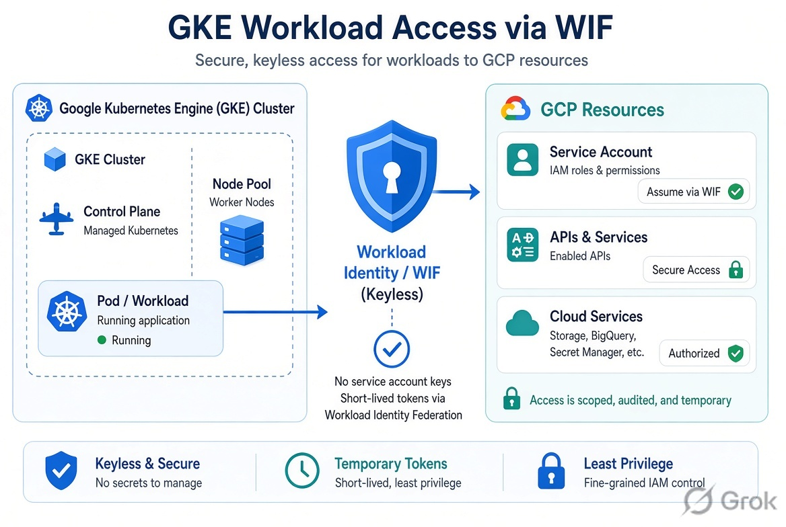

This is the delivery path for the Zimi GCP platform: GitHub Actions builds a versioned image once, stores it in Artifact Registry, and promotes that same digest through development, staging, and production. Kubernetes config is composed with Kustomize. GitHub and GKE authenticate to GCP with Workload Identity Federation, not JSON keys.

## Rebuilds, copied YAML, and keys in the cluster

Building separately for each environment looks convenient until something fails only in production. The git SHA might match; the image often does not. Different build times, different caches, different unnoticed Dockerfile changes.

Kubernetes had a quieter form of the same drift. Each service and environment carried its own copy of probes, labels, ports, and resources. A one-line fix became a scavenger hunt. Intentional prod-only differences were hard to tell from accidents.

Credentials were the third copy. Service-account keys in GitHub secrets and keys mounted into pods are long-lived, easy to over-scope, and painful to rotate. Anyone who has the file has the access.

## What changed

Main-branch CI builds one versioned container image and publishes it to a shared Artifact Registry. Development, staging, and production deploy that artifact. Runtime-specific jobs still exist — GKE, Cloud Run, Firebase — but they consume the same digest rather than rebuilding it.

Kubernetes manifests are layered:

- A **base** for the common shape: resources, labels, probes, ports.
- A **service overlay** for things that belong to one app.
- An **environment overlay** for dev, staging, or production.

CI renders the selected composition to plain YAML and deploys that. The override is visible in git; the rendered output can be reviewed before it hits the cluster.

GitHub Actions presents its OIDC identity to GCP and receives short-lived credentials. IAM bindings constrain *which* repository, branch, and workflow can assume the deployer identity, and *what* that identity may do: push images, read config, deploy to the intended project.

GKE workloads dropped mounted key files. A Kubernetes service account is bound to a GCP identity; the pod gets short-lived tokens at runtime and only the IAM roles of that identity.

## Why federation instead of JSON keys

A JSON key works from anywhere that holds it: a laptop, a fork, a log line. Federation ties access to an attested workload identity. The token expires. The condition can say “only this workflow on `main`,” which is a much smaller accident surface than “anyone with `gcp-sa.json`.”

The same rule at runtime: the pod should not know where a secret file was mounted. Application code uses ADC; GCP decides whether that GKE service account may read the bucket or publish to Pub/Sub.

The trade-off is setup cost. Federation needs a pool, provider, attribute mapping, and IAM conditions — more moving parts than pasting a key into GitHub. It is also much easier to reason about six months later, when nobody wants to be the person who rotates twenty keys.

## After

Environments promote an immutable artifact instead of rebuilding it. Kubernetes differences live in overlays. GitHub Actions and GKE workloads talk to GCP without long-lived keys in the repo or the cluster.

The same path covers Kubernetes, Cloud Run, and Firebase. A production deploy traces back to a source revision and an Artifact Registry version.

Related: [production deployment in the C4 model](/projects/iot-platform-architecture).
