## What this model is

This project is a [C4](https://c4model.com/) model of a production smart-home / smart-electrical platform I have owned since 2017. The diagrams are the work: one [LikeC4](https://likec4.dev/) source file, several views you can drill into.

The live estate behind the pictures is **70,000+ devices**, **10,000+ accounts**, **100+ events per second** and **99.999% uptime**. The system in the model is the **Smart Device IoT Platform**. Around it sit a **Home Gateway**, a **Platform API**, and the neighbouring services the household actually talks to.

**Interactive explorer** (pan, zoom, click a box to drill down): [nilushan.github.io/nilushan-projects-c4](https://nilushan.github.io/nilushan-projects-c4/). Source: [github.com/nilushan/nilushan-projects-c4](https://github.com/nilushan/nilushan-projects-c4).

Related write-ups: the [zero-downtime migration](/projects/iot-platform-migration), [voice ecosystem](/projects/voice-control-ecosystem), [admin dashboard](/projects/iot-dashboard) and [C4 / LikeC4 notes](/blog/c4-architecture-diagrams).

## System context

People around the platform: the **customer**, the **installer** who commissions a household and hands it over, and internal **admin / support / operator** roles. Neighbouring systems are a managed identity provider, an MQTT broker, Google Home, Alexa, mobile push, transactional email and a customer-engagement platform.

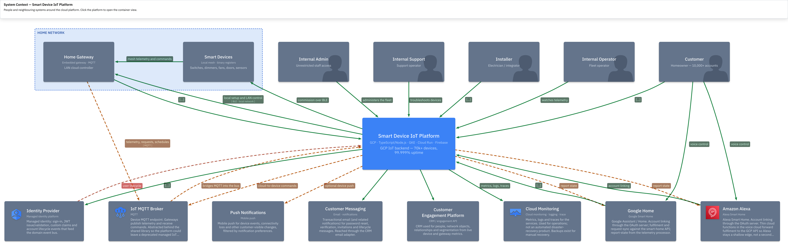

The home side is a **local device mesh** plus a **home gateway**. The gateway is the only thing that speaks MQTT to the cloud. Devices themselves stay on the LAN.

## Core containers

The slide-sized container view. Clients on the left, the API and shared library in the middle, stores on the right.

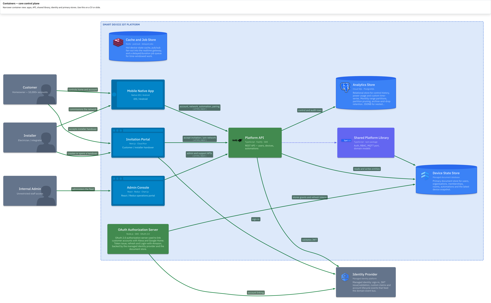

What this view is careful to show:

- a **shared platform library** (RBAC dispatch, typed document access, MQTT broker port, domain models)
- an **invitation portal** for installer → customer handover
- **Redis** as cache, pub/sub backplane and delayed-job store — not only a cache
- an **OAuth authorization server** used to link Alexa and Google Home, not a generic “identity box”

## Device telemetry and control

Unsolicited telemetry and cloud-to-device commands share one decode path.

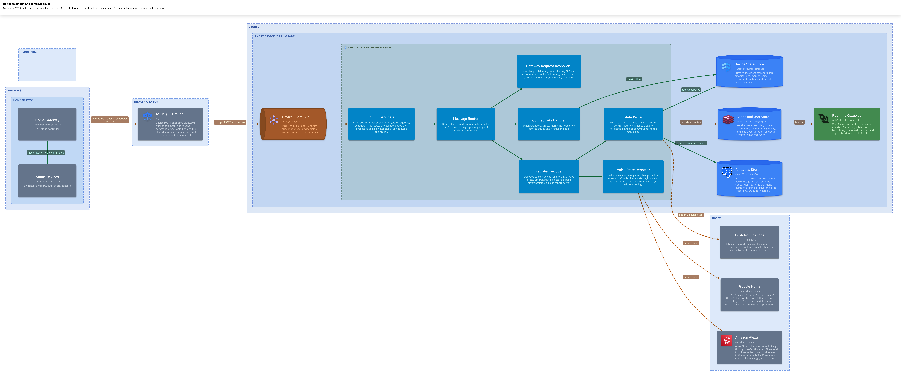

- The gateway publishes state, requests and schedules onto the MQTT broker.
- A **device event bus** fans those messages to pull subscribers.
- A **register decoder** turns a packed binary protocol into typed state. Dimmers, fans, garage doors and sensors expose different registers; every type also reports power.
- Snapshot goes to the document store, history and power to partitioned PostgreSQL, hot state to Redis.
- Redis pub/sub feeds a **WebSocket realtime gateway** so apps do not poll.
- User-visible register changes are **reported** to Alexa and Google Home.
- Gateway requests (provisioning, keys, CRC, schedules) are **request/response**, not fire-and-forget.

## Identity and access

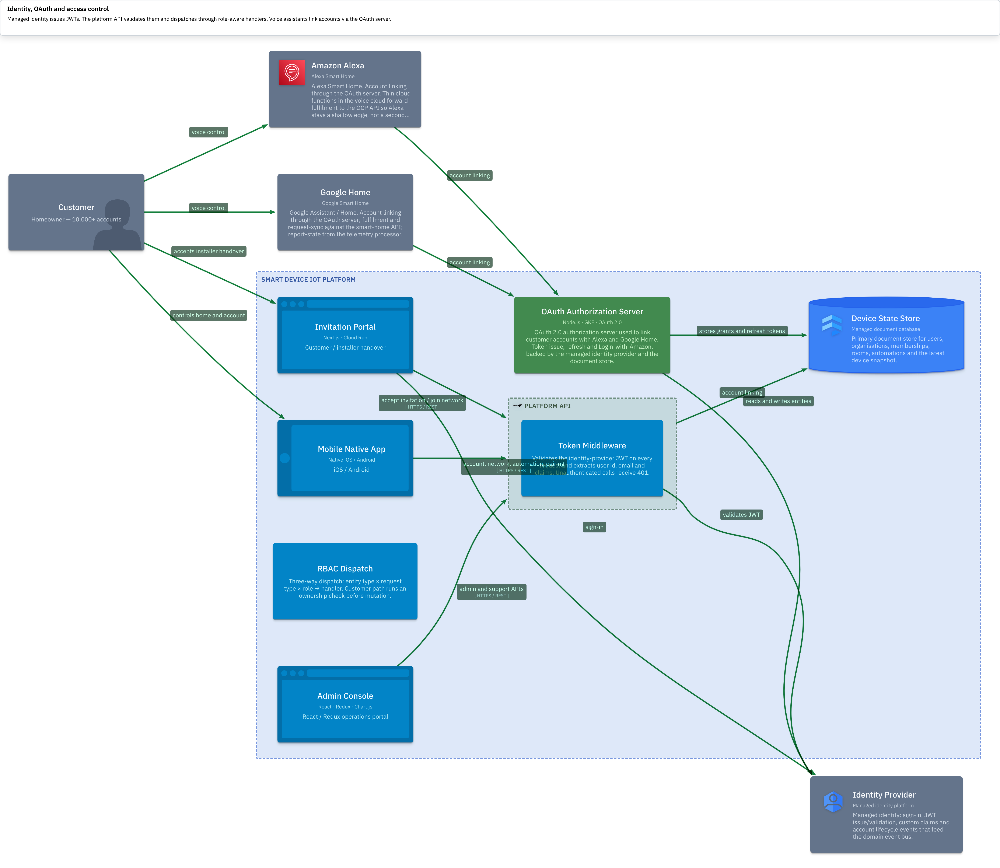

The platform API validates the identity-provider JWT on every call, then dispatches through role-aware handlers: unrestricted admin path versus ownership-scoped customer path. Voice assistants never see those credentials — they link accounts through the OAuth server.

## Voice assistants

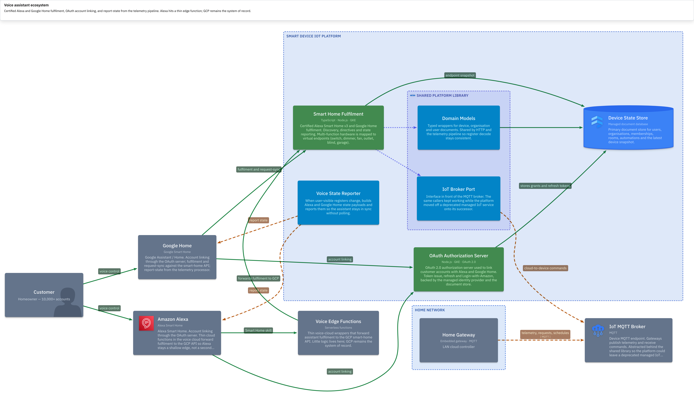

Both Alexa Smart Home v3 and Google Home are certified. Multi-function hardware is mapped to virtual endpoints (switch, dimmer, fan, outlet, blind, garage). Alexa hits a **thin voice-cloud wrapper**; fulfilment, state and commands stay on GCP. Report-state comes from the telemetry processor so the assistant does not poll.

## Data platform

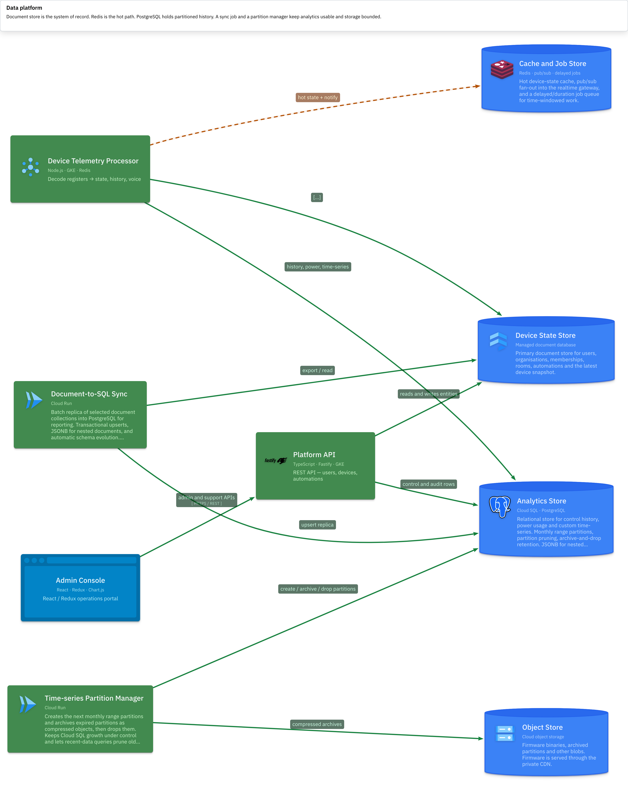

- Document store: system of record for users, networks, memberships and the latest device snapshot.
- Redis: hot reads, pub/sub into the realtime gateway, delayed/duration jobs.
- PostgreSQL: control history, power, custom time-series. **Monthly range partitions**, prune on query, archive-and-drop expired ranges to object storage.
- A document-to-SQL sync keeps a reporting replica with JSONB and schema evolution.

The sync and partition tools were delivered with AI coding assistance. I do not list Go or Python as production expertise.

## Firmware and onboarding

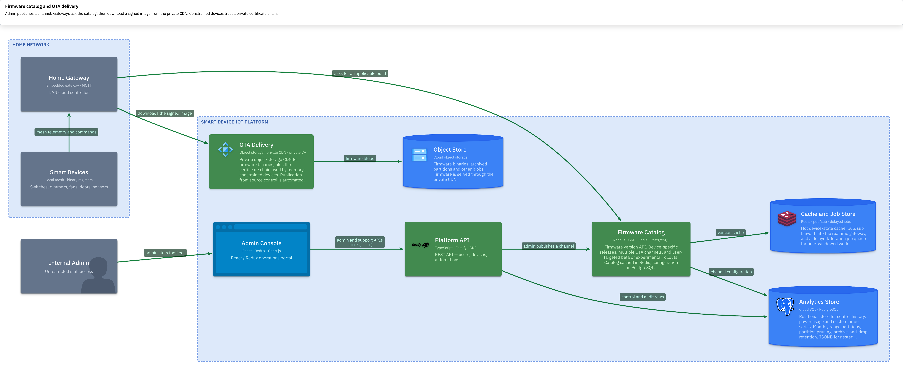

Device-specific releases, beta channels and user-targeted rollouts. Gateways ask the catalog, then pull a signed image from a private CDN. Constrained devices trust a private certificate chain.

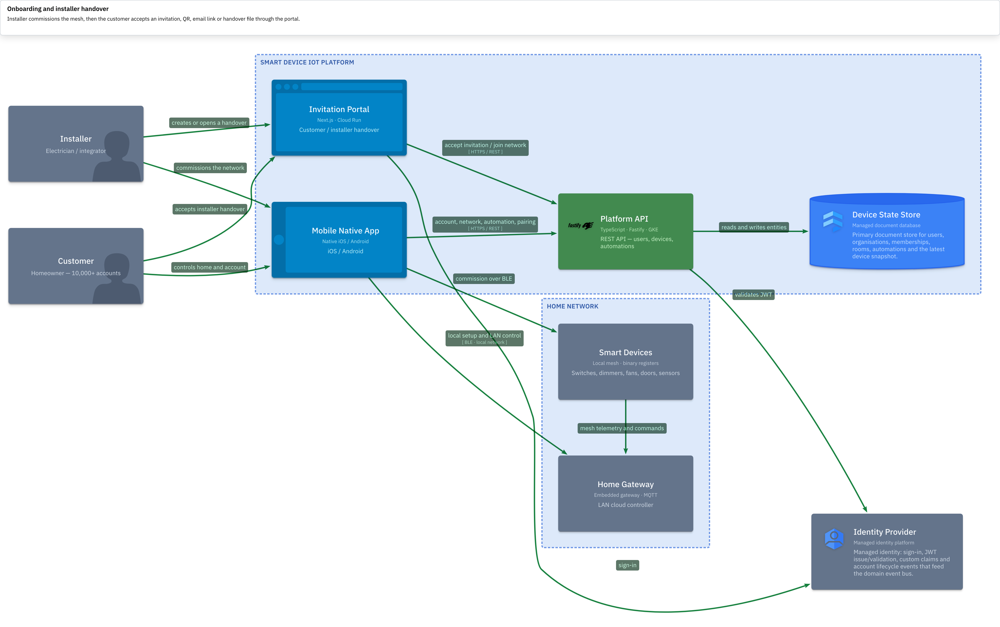

Installers commission on the LAN, then the customer accepts a code, QR, email link or handover file in a focused Next.js portal.

## Flows

A customer toggling a device from the app — authenticated API call, MQTT command, decode, live UI confirmation:

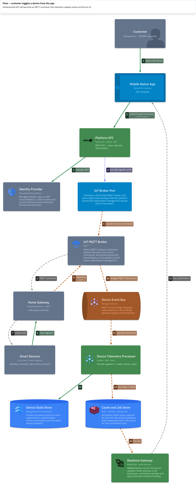

Voice directive, unsolicited telemetry, and installer handover:

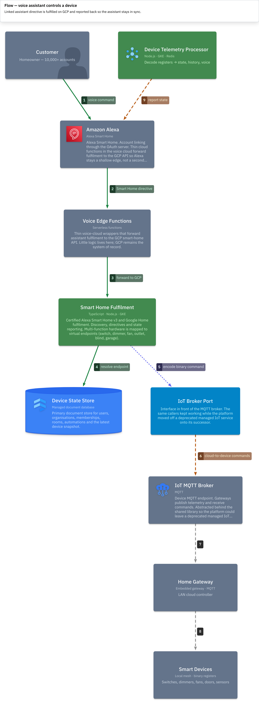

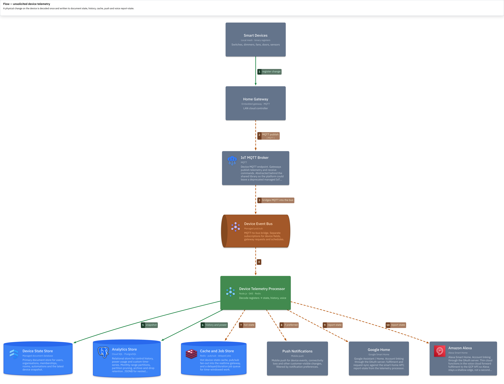

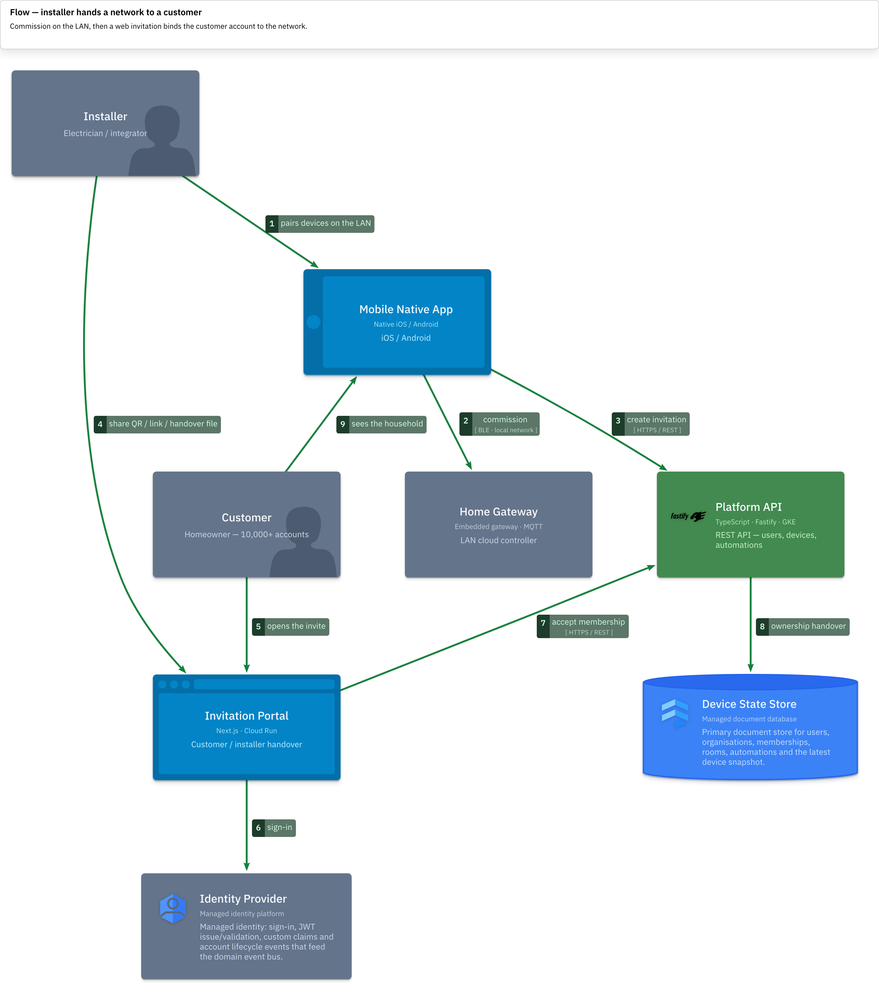

## Production deployment

Long-running services on GKE. Invitation portal, CRM sync, document-to-SQL and partition management on Cloud Run. Domain-event publishers as Cloud Functions. Data and buses are managed services. The same versioned images are promoted across environments. GitHub Actions and GKE workloads talk to GCP through **Workload Identity Federation** — no long-lived service-account keys.

## Designed, not shipped

The Matter manufacturing cloud — factory registration, catalogues, quotas, serials, pairing material, mTLS and HSM-backed identity — is an architecture I designed. It is not a live factory, and the diagrams mark it that way.

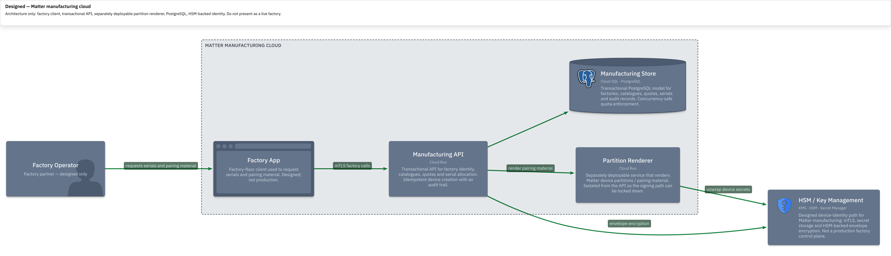

I also do not claim a payment gateway, a GraphQL API, or Apple Home as a cloud fulfilment integration I built. Apple Home appears only as a local Matter path on the designed landscape.

## How the model is kept

The LikeC4 source lives in its own repo, [nilushan/nilushan-projects-c4](https://github.com/nilushan/nilushan-projects-c4). Views are projections of one model: context, containers, components, dynamic flows and deployment. Pushes to `main` publish the [interactive explorer](https://nilushan.github.io/nilushan-projects-c4/) on GitHub Pages.
